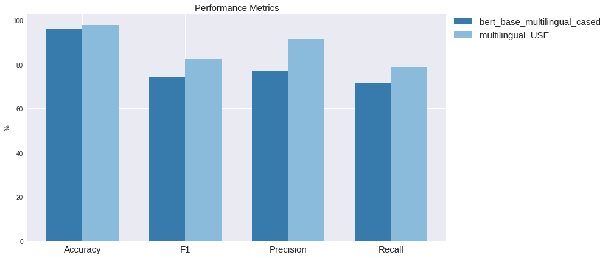

# Claim-Identification
Experiments for developing a multilingual classifier for claim Check-Worthiness

The present exercise is not intended to be a thorough analysis of multilingual text classifiers, rather a simple comparison between a couple of models that can be used to solve the task, and the observations that can be raised during the implementation process.

That said, we have proposed two different solutions. Each of them are State-Of-The-Art models, and we will take advantage of them by fine-tuning their available pre-trained Language Models. They are listed below:

1. **Multilingual BERT** (*required solution*): Recently released ``bert-base-multilingual-cased`` is the current recommended model to use by its authors in Google-Research. The model architecture and benchmarking can be consulted [here](https://github.com/google-research/bert/blob/master/multilingual.md). In this solution, we are going to use a BERT-architecture for sequence classification downstream task so, as its authors specify in the original paper, in the top of the stacked of transformer encoders use for pre-training the masked language model, it will be added a fully-connected dense layer with a softmax activation function for using it as a text classifier. For this task, only the first token embedding of the encoded sequence will be used, that is the special ``[CLS]`` token.
2. **Multilingual Universal Sentence Encoder** (*optional solution*): This family of models is a compendium of many other models. The core idea behind of it, is not the encoder itself, used to embed the text into meaningful vectors, but the bunch of multiple tasks it has been fine-tuned to obtain sentence-level embeddings. Its flexibility for using different encoders (Transformer, Deep Averaging NN and CNN, so far) allows to play with the tradeoff of accuracy/efficiency depending of out requirements. Moreover, taking into acount [this study](https://docs.google.com/spreadsheets/d/14QplCdTCDwEmTqrn1LH4yrbKvdogK4oQvYO1K1aPR5M/edit#gid=0) carried out by the **UKPLab** of the Darmstadt university, for some tasks, generating a sentence-level embedding by the aggregation of the different token embeddings of the sequence, can outperform the use of the ``[CLS]`` special token from BERT. And this last thing is what Universal Sentence Encoder family can provide to us.

## Results and comparison analysis

Here we present the results obtained on the testset:

## Final thoughts

Seems that, at least for not very large datasets, the ability of extracting good high level sentence representations, provides to the classifier greater knowledge when dealing with sentences with very subtle differences like in this problem.

Maybe a good point for continue the study would be to incorporate additional information to the model, such as entities or part-of-speech units. The addition of this features might mean also the addition of some previous error, but maybe for political claims that talk about famous politicians, other parties, or international companies, would add some additional information for the discriminative analysis.

The analysis done here is very short and naive, a more in depth study of "where are we failing" in the testset predicted data, for sure will show more improving points to focus on.
  
